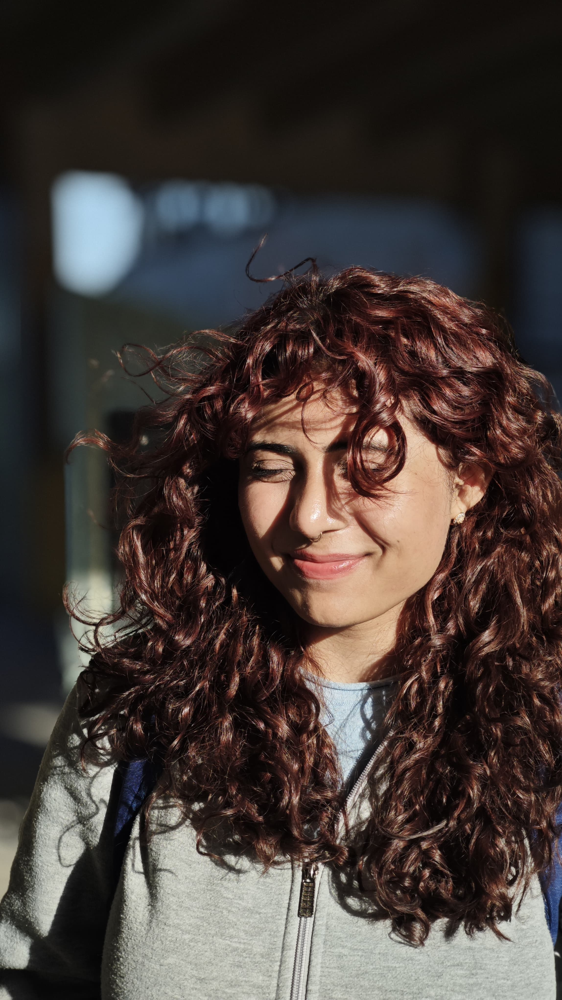

<!DOCTYPE html>
<html lang="en">
<head>
  <meta charset="UTF-8">
  <title>Saniya Irfan | Digital Humanities</title>
  
</head>
<body>

  

  <h1>👩‍💻 Saniya Irfan aka San</h1>
  
<strong>PhD Scholar | IIT Delhi | Digital Humanities</strong>

  

    <h2>📌 Research Interests</h2>
    <ul>
      <li>Urdu Marsiya and intertextuality</li>
      <li>Distant Reading & Text Mining</li>
      <li>NLP in historical Urdu literary texts</li>
      <li>Computational Stylistics</li>
      <li>TEI markup for South Asian literary archives</li>
    </ul>
  

  

    <h2>🎓 Education</h2>
    <ul>
      <li>MA in English Literature [2019] – Jamia Millia Islamia, New Delhi</li>
      <li>Diploma in Translation Proficiency [2020] – Jamia Millia Islamia, New Delhi</li>
      <li>PhD (continuing) – IIT Delhi</li>
    </ul>
  

  

    <h2>💼 Work Experience</h2>
    <ul>
      <li>Teaching Assistant, Department of HSS, IIT Delhi (2022–present)</li>
      <li>Coordinator, International Students Program, IIT Delhi (May 2024–present)</li>
      <li>Jugad CoLab Fellow, Michigan State University (2021–present)</li>
      <li>Project Coordinator, Lisan India, New Delhi (Nov 2020–Aug 2022)</li>
      <li>Student Advisor, University of Virginia Exchange, Jamia (Jan–Mar 2020)</li>
    </ul>
  

  

    <h2>🛠️ Projects</h2>
    <ul>
      <li><strong>TEI-Encoded Urdu Marsiya Archive:</strong> Developing a semantic-rich, machine-readable edition of Mir Anees's Marsiya corpus.</li>
      <li><strong>NER Pipeline for Urdu Literature:</strong> Fine-tuned NLP workflows for stylistic analysis of literary entities.</li>
    </ul>
  

  

    <h2>🧠 Skills</h2>
    <ul>
      <li><strong>Text Analysis Tools:</strong> Sketch Engine, Voyant, Palladio, Oxygen XML Editor, R, Python</li>
      <li><strong>CAT Tools:</strong> SDL Trados, MemoQ, Smartling</li>
    </ul>
  

  

    <h2>📚 Publications</h2>
    <ul>
      <li>Chauhan, Rohan, et al. (2023). <em>Jugaad CoLab: Decolonial Poetics, Minimal Computing, and South Asian DH</em>. <a href="https://doi.org/10.16995/dscn.9611">Digital Studies</a></li>
      <li>Irfan, S. (2023). <em>Digital Assessment of Urdu Marsiya using Sketch Engine</em>. <a href="https://doi.org/10.4324/9781003325239">Routledge DH Volume</a></li>
      <li>Irfan, S., & Ali, J. (Forthcoming). <em>Developing a TEI-Encoded Archive of Urdu Marsiya</em>. <a href="https://journal.tei-c.org/">Journal of the TEI</a></li>
    </ul>
  

  

    <h2>🌐 Connect</h2>
    <ul>
      <li><a href="https://www.linkedin.com/in/sansue/">LinkedIn</a></li>
      <li>Email: huz228239@iitd.ac.in</li>
      <li><a href="https://hss.iitd.ac.in/student/saniya-irfan">IIT Delhi Profile</a></li>
    </ul>
  

  
“Marsiya is not just elegy. It's a memory map of grief, identity, and resistance.”

</body>
</html>
